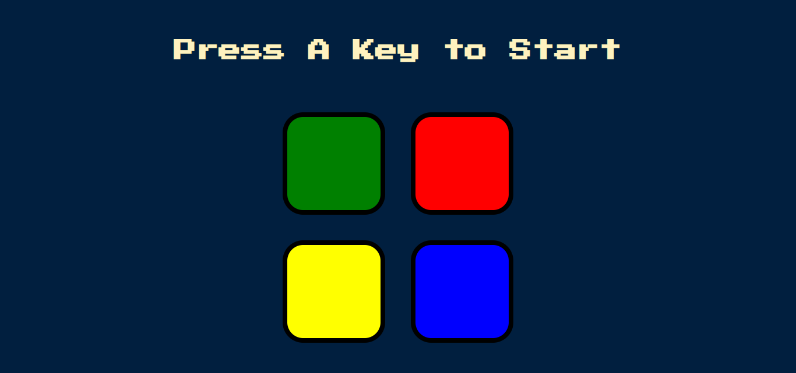

# Simon Game

A digital version of the classic Simon memory game, built with HTML, CSS, JavaScript, and jQuery.

## Description

This project is a web-based implementation of the popular Simon memory game. Players must remember and repeat an increasingly complex sequence of colors and sounds.

### Features

- Four colored buttons (green, red, yellow, blue)
- Sounds associated with each button
- Progressively challenging sequences
- Level tracking

## How to Play

1. Press any key to start the game
2. Watch and listen to the sequence played by the game
3. Repeat the sequence by clicking the buttons in the correct order
4. If successful, the game will add one more step to the sequence
5. Continue playing to achieve the highest score possible
6. If you make a mistake, the game will end

## Technologies Used

- HTML5
- CSS3
- JavaScript
- jQuery

## Installation

1. Clone this repository
2. Open `index.html` in your web browser

## Contributing

Contributions, issues, and feature requests are welcome. Feel free to check [issues page](link-to-issues-page) if you want to contribute.

## License

[MIT](https://choosealicense.com/licenses/mit/)

## Acknowledgments

- Inspired by the original Simon game by Milton Bradley
